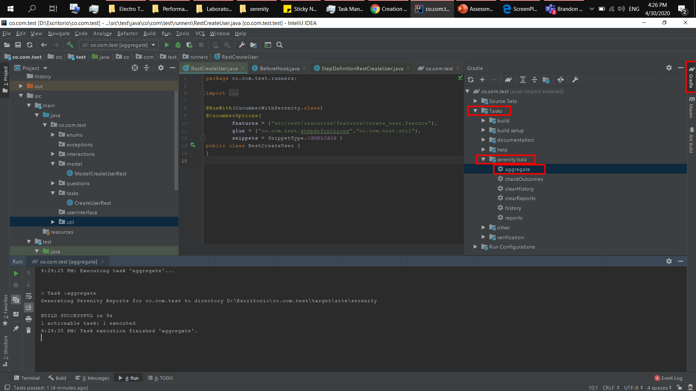

# Serenity BDD

Contains the automation projects developed with SerenityBDD, Java, Cucumber (Gherkin), ScreenPlay

## Utilities for Working with SerenityBDD

### - Wait Explicit

```Java
// Imports
import static net.serenitybdd.screenplay.matchers.WebElementStateMatchers.isVisible;
import net.serenitybdd.screenplay.waits.WaitUntil;

// Explicit Wait
actor.attemptsTo(
    WaitUntil.the(HomePage.BOTON_ADD, isVisible())
        .forNoMoreThan(2).seconds()
);
```

### - Build projects and Execution
Build:
```
gradle wrapper
```

Execution:
```
gradlew.bat clean test --tests *RunnerTags* aggregate --info
```

### - Aggregate Index.html into the /Target

For middle of Intellij:



For middle of command: 
```
gradle -Dtest.single=RunnerTags test aggregate
```

### - Actions

Click
```
actor.attemptsTo(Click.on(PhpTravelsBlogPostPage.BOTON_ADD));
```

Enter Text
```
actor.attemptsTo(Enter.theValue(post.get(0).getPost_title()).into(PhpTravelsBlogPostPage.CAMPO_POST_TITLE));
```

Select Value
````
actor.attemptsTo(SelectFromOptions.byVisibleText(post.get(0).getCategory()).from(PhpTravelsBlogPostPage.CAMPO_CATEGORY));
```