# Reto-Automatizador

## Implementación Local
Requisitos: 
- Gradle
- JDK 
- Cucumber

Copiar `docs/chromedriver.exe` dentro de `src/test/resources/driver/`

Construir el Proyecto con el comando: `gradle wrapper` 

## Ejecución
Usando el comando: `gradlew.bat  clean test --tests *RunnerTags* aggregate --info`

## Desarrollo
- Se implementan en la capa `Models` modelos DTO para manejar los datos de `Categorías` y `Post`.
- Se implementan 2 esperas explícitas `(WaitUntil)` para dos elementos que muestran delay en las ejecuciones.
- Se implementa una clase Constantes.java en la capa `Util`
- No se crean DataDriven ya que para el ejercicio no se requiere de una gran volumetría de datos
- Se implementan 2 escenarios en una única caracteristica bajo el modelo de `Gherkin`
- Se usa la Sentencia `Background` en el .feature como buena práctica para este Reto, ya que los 2 escenarios planteados cumplen la misma pre-condición

## Resultado de Ejecución

Ejecución de Build con: `gradle wrapper`

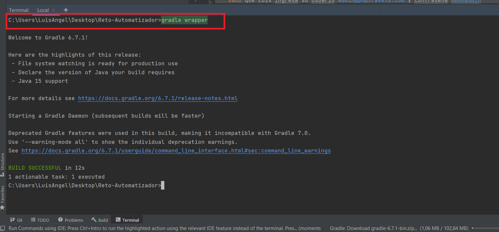

Ejecución de Pruebas con: `gradlew.bat  clean test --tests *RunnerTags* aggregate --info`

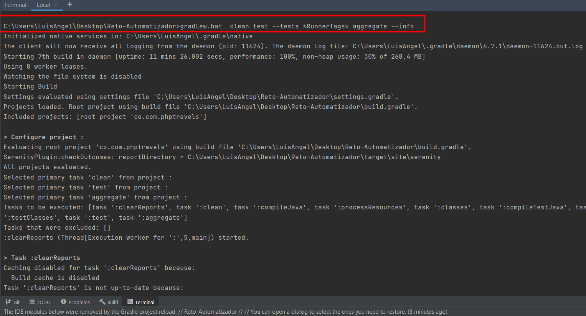

Resultado de ejecución de casos de pruebas por consola:

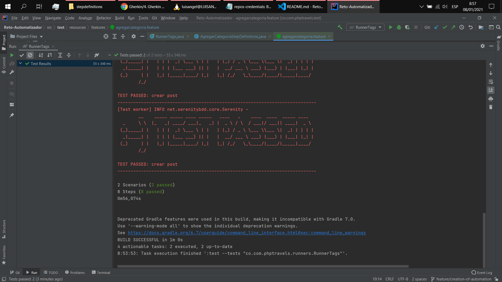

Reporte de Ejecución:

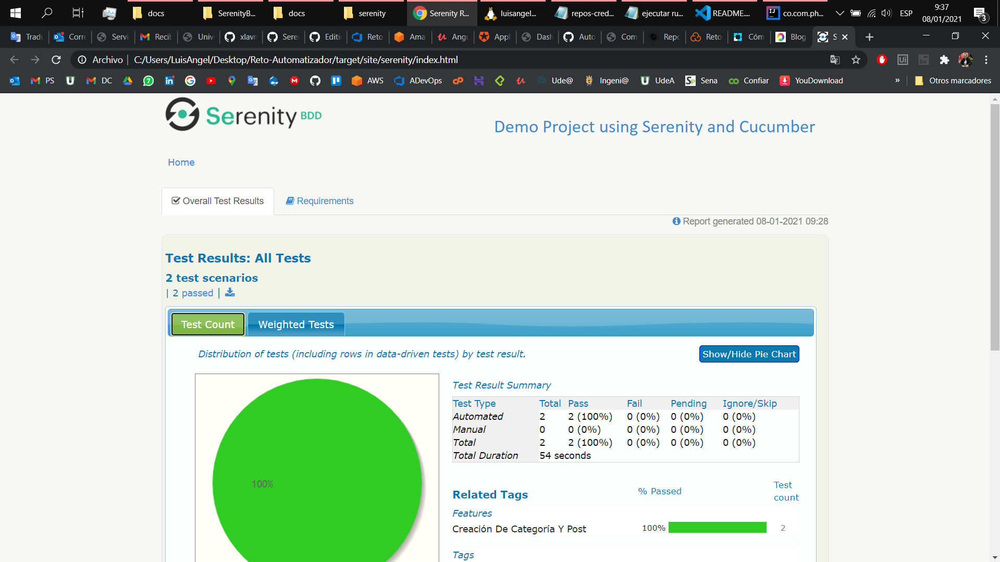

## Video de Ejecución

> VIDEO DE LA EJECUCIÓN: https://youtu.be/DVIIFhxSm1s

## CI/CD con Azure DevOps

### Pipeline de CI:
- Analisis de Código Estatico con Sonar
- Construcción del Proyecto de Automatización con Gradle

Tareas:
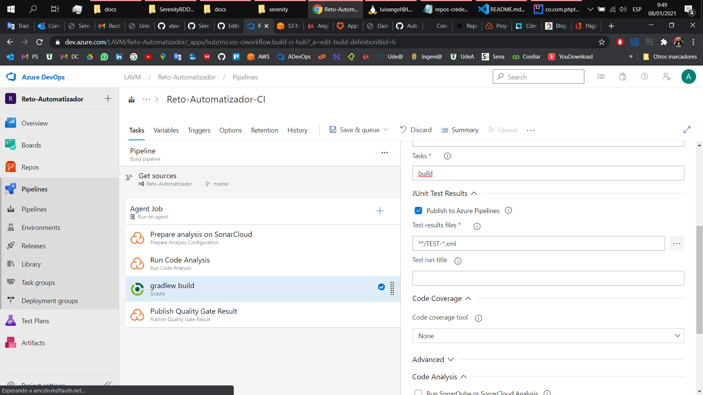

Ejecuciones Automaticas:
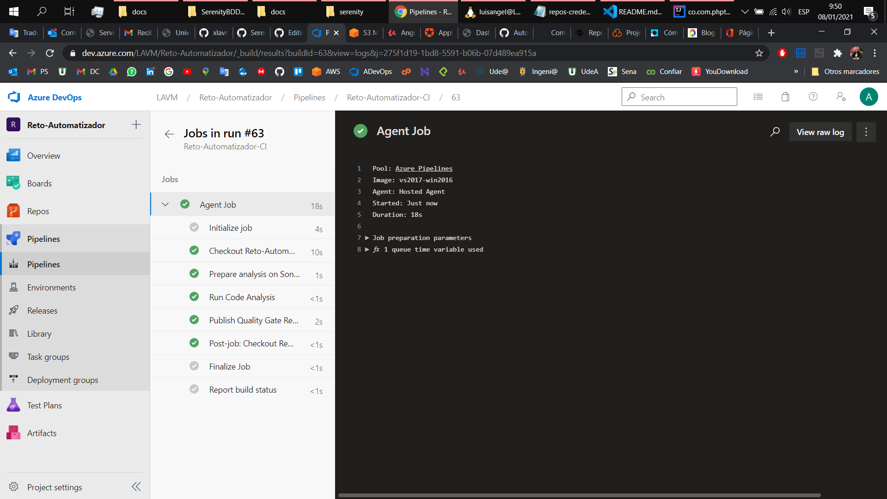

Sonar:
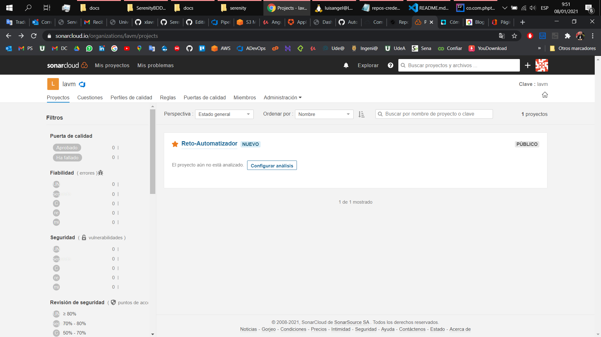

### Pipeline de CD:
- Despliegue de Reporte en AWS S3

para ver el reporte final, ingresa aquí: https://s3.amazonaws.com/target.serenity.reto/target/site/serenity/index.html

Tareas:
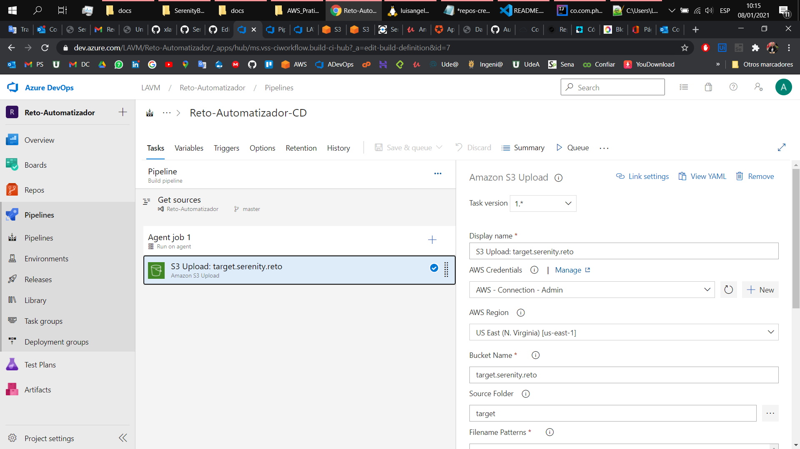

Ejecuciones Automaticas:
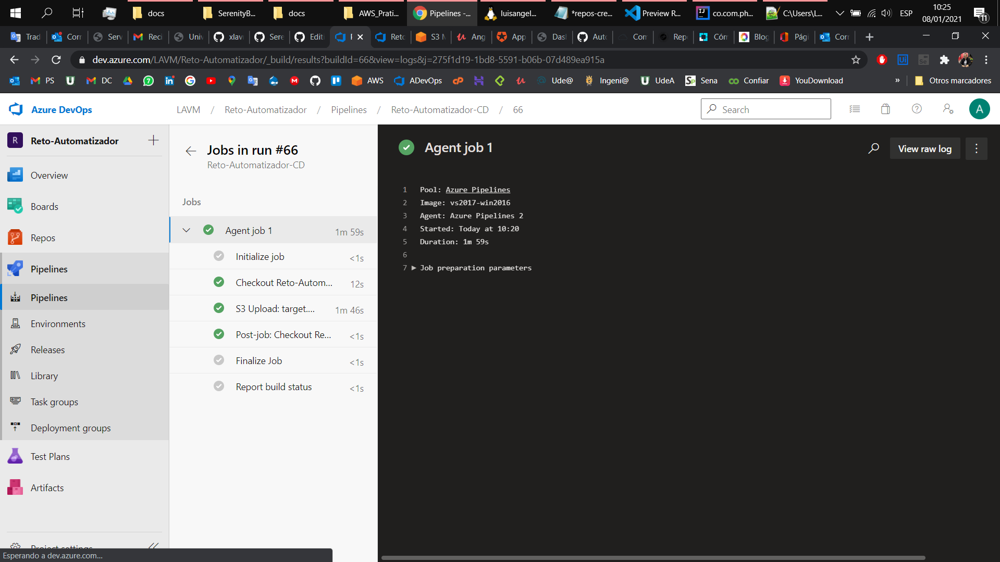

AWS:
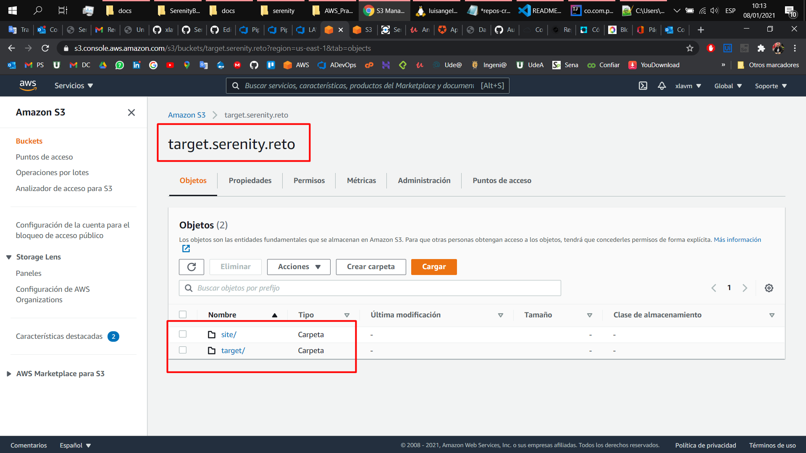

Reporte:
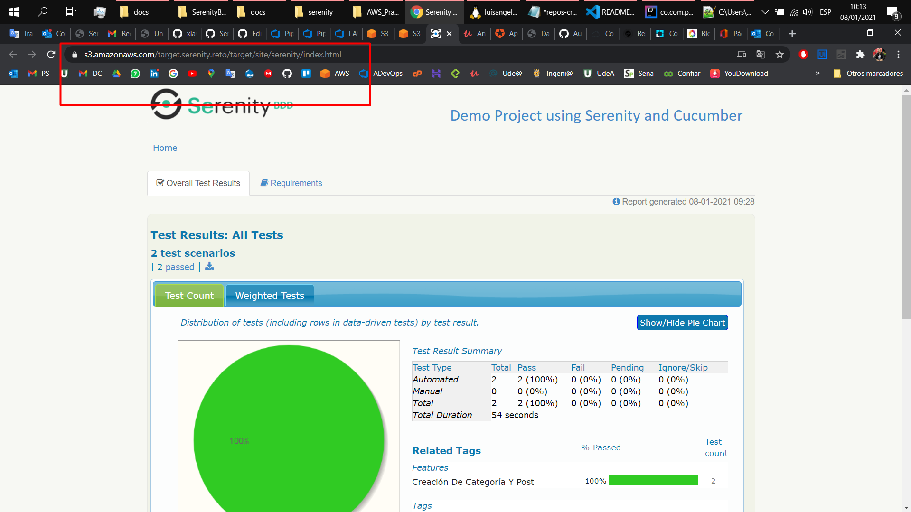

