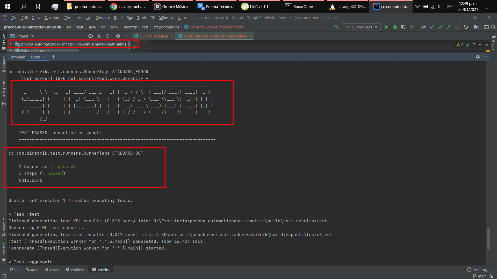
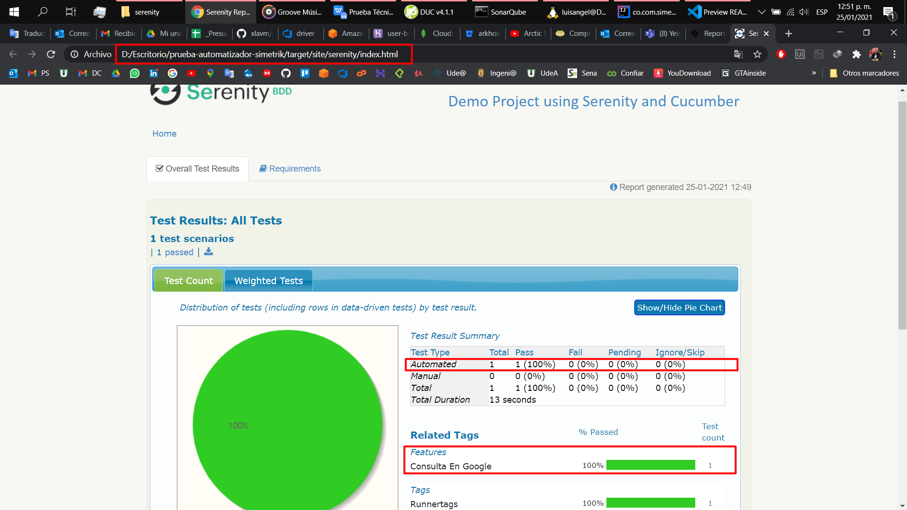

# Prueba Simetrik Automatizador

## Implementación Local
Requisitos: 
- Gradle
- JDK 
- Cucumber

Copiar `docs/chromedriver.exe` dentro de `src/test/resources/driver/`

Construir el Proyecto con el comando: `gradle wrapper` 

## Ejecución
Usando el comando: `gradlew.bat  clean test --tests *RunnerTags* aggregate --info`

## Desarrollo
- Se implementa 1 escenario en una única caracteristica bajo el modelo de `Gherkin` con `Cucumber`
- Se implenta el patrón de diseño `Screenplay` para aplicar los principios SOLID
- Se usa el lenguaje `Java` con el framework `Serenity BDD`
- Se usan librerías de `Selenium` por medio de Serenity BDD 
- Se hace uso del `chromedriver` de google 

## Resultado de Ejecución

Ejecución de Pruebas con: `gradlew.bat  clean test --tests *RunnerTags* aggregate --info`

Reporte de Ejecución:

## Video de Ejecución

> VIDEO DE LA EJECUCIÓN: https://youtu.be/S6a51sfHbU8

